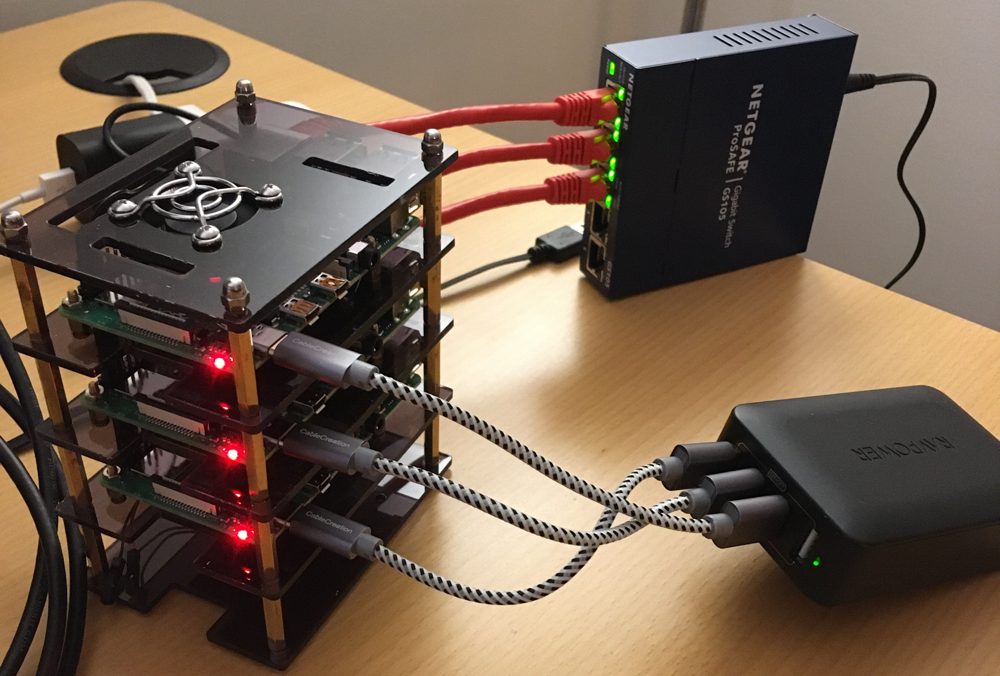

# raspberry-pi-k8s

This repo contains details to build your own 3-node Raspberry Pi cluster with Kubernetes.

The cluster consists of 3 Raspberry Pi 4s mounted in a Pi cluster case. They are powered via a USB charger and optionally networked via Cat6 ethernet cables and a switch. Although I purchased the wired networking materials, I eventually decided to network them via my home wifi network, so these materials were ultimately unnecessary.

The Kubernetes cluster in this example consists of 1 master and 2 compute nodes. The master is determined by hardcoding the IP of the master as instructed below. During setup, that Pi will execute instructions to become the master of the cluster, and the other Pis will execute instructions to become nodes. You'll see, it's cool. :-)

# Purpose
I wanted to learn more about how Kubernetes works _after_ you set up the basics, so I created this automation to easily re-build a cluster whenever I wanted to start over. It's based heavily on the steps outlined in https://opensource.com/article/20/6/kubernetes-raspberry-pi, with modifications.

# Instructions
## Assemble the basics
1. Purchase and assemble the items in the [Hardware Inventory](#hardware-inventory). It should look something like: 
1. Download and install the Raspberry Pi Imager for your operating system: https://www.raspberrypi.org/downloads/.
1. Download the latest Ubuntu Server 64-bit image from https://ubuntu.com/download/raspberry-pi. Currently Ubuntu Server 22.04.2 64-bit for Raspberry Pi 4 is recommended: https://ubuntu.com/download/raspberry-pi/thank-you?version=22.04.2&architecture=server-arm64+raspi. The result should be a single `.img.xz` file.

## Determine the IP address of the master
The automation in this repo requires the IP address of the cluster's master node. Determine which Pi will be the master node of the cluster. Then, determining the IP address of the master depends on the network setup as well as the operating system you are using to write images to the MicroSD card.

For example, my network allows any device to join (with a password), provides DHCP and unofficially reserves IPs (because I have so few devices). In this case, I use the instructions below to add my wifi info to an Ubuntu MicroSD image and boot the Pi. I can then see the device via my router admin pages or I can attach a keyboard and mouse to login and get the IP.

Once you determine the IP for the master, make a note of it for use later in the setup process.

## Then, depending on your OS, do the following:
### On Mac OS X
1. Unzip the `.xz` image file by double-clicking on it. The result should be a single `.img` file.
1. Mount the image with write capabilities by double-clicking on the `.img` file in Mac OS Finder. It mounts a `system-boot` volume.
1. From this repo, copy `ubuntu-system-boot/network-config.orig` to `ubuntu-system-boot/network-config` and modify the file with your local network settings.
1. In Terminal, replace your network settings from the previous step to the default settings file by running (from the main `raspberry-pi-k8s` directory):
   ```cat ubuntu-system-boot/network-config > /Volumes/system-boot/network-config```
1. Also from this repo, copy `ubuntu-system-boot/user-data.orig` to `ubuntu-system-boot/user-data`. If you are planning to use the [MetalLB Kubernetes load balancer](https://metallb.universe.tf), un-comment the line which sets the `ENABLE_PROMISCUOUS_MODE` environment variable.Then, modify these values:
   * `<MASTER_IP>`: the IP address of the desired Kubernetes master
   * `<K8S_BOOTSTRAP_TOKEN>`: the Kubernetes bootstrap token, e.g., `07401b.f395accd246ae52d`
1. In Terminal, append your first boot instructions from the previous step to the default first boot file by running (from the main `raspberry-pi-k8s` directory):
   ```cat ubuntu-system-boot/user-data >> /Volumes/system-boot/user-data```
1. In the Mac OS Finder, unmount the `system-boot` volume by right-clicking on `system-boot` and selecting `Eject "system-boot"`. The changes made will be saved in the `.img` file.
1. Assuming the `.img` files are on the Desktop, create a new modified `xz` archive by running (in Terminal):
   ```tar -cJf ~/Desktop/MODIFIED-<FULL_NAME_OF_MODIFIED_IMAGE_FILE>.xz ~/Desktop/<FULL_NAME_OF_MODIFIED_IMAGE_FILE>```
1. For each Pi in the cluster:
   1. Insert the Pi MicroSD card into the USB MicroSD Card Reader and insert the card reader into a USB port on your computer. The volume should be automatically recognized by the Mac OS Finder.
   1. Launch the Raspberry Pi Imager and press the "Choose OS" button. Select the custom image `MODIFIED-<FULL_NAME_OF_MODIFIED_IMAGE_FILE>.xz`.
   1. Press the "Choose SD Card" button and select the destination SD card.
   1. Finally, press the "Write" button to write the `.img.xz` file to SD card.
   1. When complete, remove the MicroSD card from the USB MicroSD Card Reader and put the SD card in the Pi.
1. When ready, re-connect the power cable for the cluster. The `bootstrap.sh` script will execute on each Pi. It will install Kubernetes (with the Flannel CNI add-on) and then reboot. The master will create the cluster and the nodes will join the cluster. After about 5-7 minutes, the cluster will be ready.
#### Optional Post-Installation Steps
1. SSH into the master, e.g. `ssh ubuntu@<MASTER_IP>` and run `kubectl get nodes`. Confirm the master and all nodes are registered and in a Ready state.
1. Install `kubectl` locally. For example, you can install it using HomeBrew with `brew install kubectl`.
1. With `kubectl` installed, copy the cluster configuration file to your local computer so that you can use `kubectl` locally to work with the cluster. Run `scp ubuntu@<MASTER_IP>:/home/ubuntu/.kube/config ~/.kube/.` to grab the configuration file.
1. SSH into each of the nodes and change the default passwords to a secure password.
1. Install additional items on the cluster like linkerd, MetalLB and some sample apps via https://github.com/ekiczek/raspberry-pi-k8s-cluster-basics.

### On Windows
1. TBD

### On Linux
1. TBD

<a href="#hardware-inventory"></a>
# Hardware Inventory
* 3 Raspberry Pi 4Bs, 4GB: https://www.amazon.com/gp/product/B07TC2BK1X
* 3 SanDisk 128GB Extreme microSDXC UHS-I Memory Card with Adapter: https://smile.amazon.com/gp/product/B07FCMKK5X
* USB-C to USB-A power cables: https://www.amazon.com/gp/product/B07CKW6W24
* Case: https://www.amazon.com/gp/product/B07MW24S61
* USB charger (as power supply to Pis): https://www.amazon.com/gp/product/B00OT6YUIY
* Optional, if you want to try wired ethernet instead of wifi:
  * Network switch: https://www.amazon.com/gp/product/B0000BVYT3
  * Cat6 cables for networking: https://www.amazon.com/gp/product/B01MZCXGPQ

Total cost with optional items (December 2020): $367

NOTE: I already had a USB MicroSD Card Reader similar to https://www.canakit.com/mini-micro-sd-usb-reader.html. This is required to write MicroSD card images.

# References
* http://www.pidramble.com (for ideas on parts)
  * Parts list: http://www.pidramble.com/wiki/hardware/pis
* https://opensource.com/article/20/6/kubernetes-raspberry-pi - I followed this script mostly, with updates.
